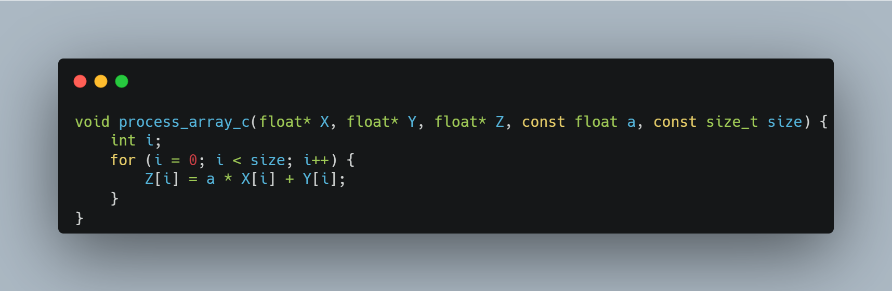
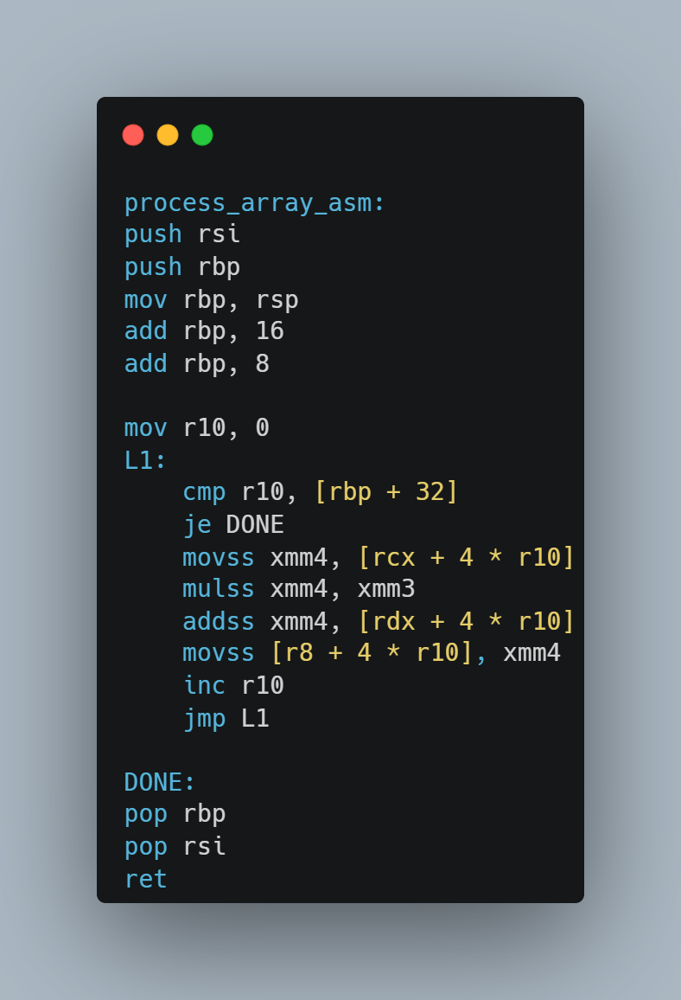
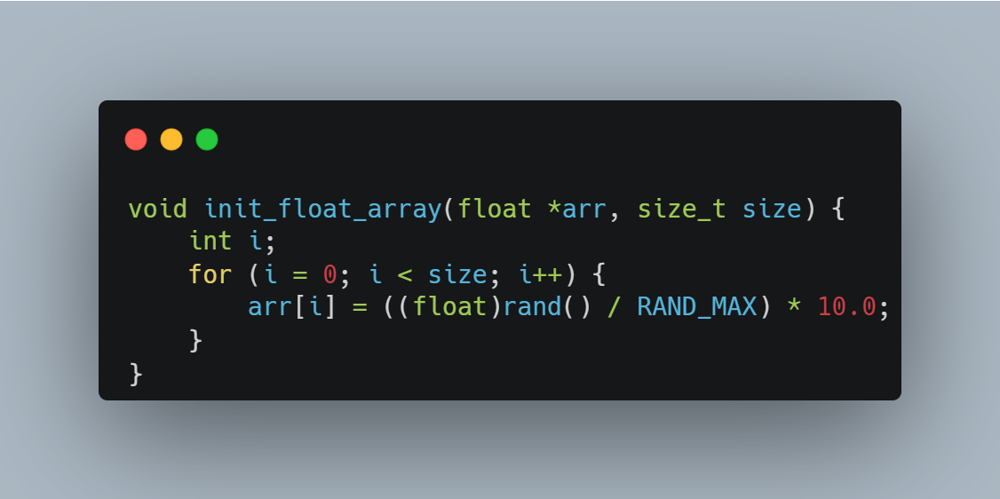
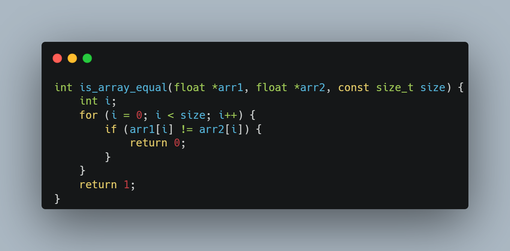
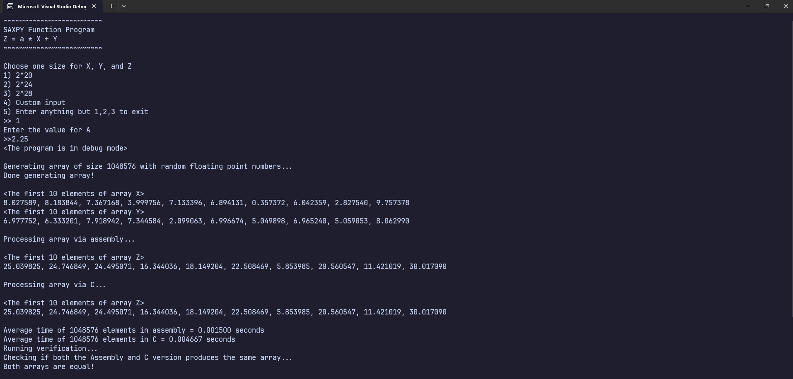
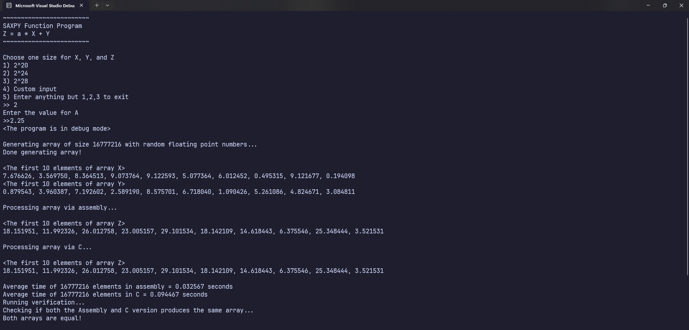
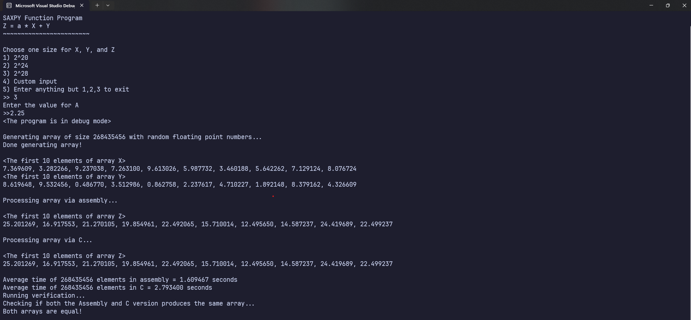
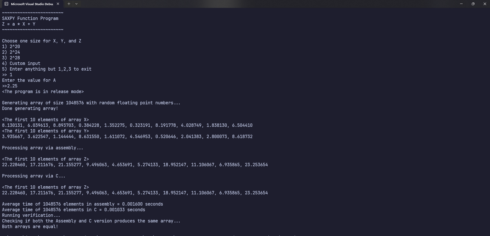
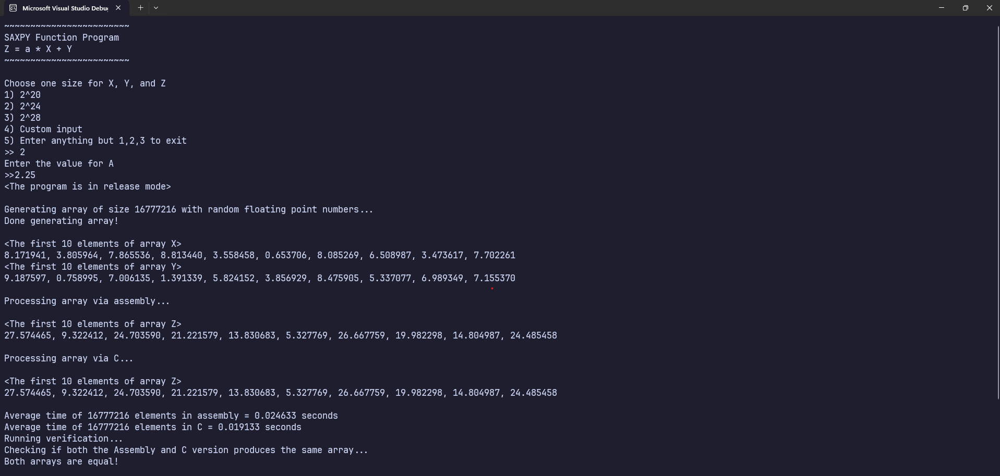
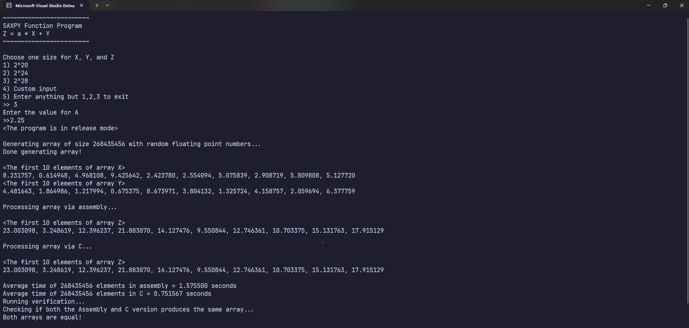

## The SAXPY Function
This project implements the SAXPY (Single-precision A\*X + Y) function in both C and Assembly language (x86-64). SAXPY is a fundamental operation in linear algebra and scientific computing, used in various algorithms. The project explores the performance of this function in both languages in debug and release mode. 

## Implementation
The SAXPY Function is written as $Z[i] = a * X[i] + Y$. 

| C Code | Assembly Code | 
| ---------- | --------- | 
|  | 

### C Code
The C code closely mimics the equation, being able to implement the function in a handful of lines. This makes the code readable, and straightforward. Each variable resembles those in the SAXPY function, being able to use names such as $a, X, Y, Z$. 

### Assembly Code
Although much more verbose, the Assembly version provides much more control over the CPU, providing access to most registers and the instruction set given by the CPU. The following registers holds these values:
- **rcx**: pointer to X\[0]
- **rdx**: pointer to Y\[0]
- **r8**: pointer to Z\[0]
- **xmm3**: a
- **\[rbp+32]**: size 

There are other registers, such as *r10* and *xmm4* to act as a counter and temporary store respectively. as well as rsi and rbp to set up the stack frame. 

The SAXPY function performs multiplication, addition, and assignment operations over floating point numbers (32 bits). Thus, we are to use the SIMD instructions and registers. Lastly, for simplicity's sake, volatile registers are utilized to pass the responsibility of preserving values to the caller of the Assembly function. 

The multiplication operation $a  * X$ is done via the *mulss* instruction, stored in the *xmm4* register. After this, the addition operation is done via the *addss* operation. Lastly, the result is stored via the *movss* instruction. 

### Array contents 
Given the size of the array, both $X$ and $Y$ are generated random values.

### Correctness Check
To verify that both programs produces the same output, two arrays for $Z$ are utilized to compare its contents. A function in C was written to make sure that both outputs match. This is ran at the end of the program once all calculations are done for both C and Assembly.

### Hypothesis
It is not entirely invalid to assume that the performance of the Assembly code is much faster than C. But over the years, optimizations for the C compiler have been introduced. Thus, to confirm whether or not the Assembly version performs better, the average time for each version is recorded for both the *Release* and *Debug* mode. Each version is ran 30 times to take the average.  The value of $a$ will be $2.25$ across all tests.

## Debug Mode

![[c_vs_asm_debug.png]]
Currently, the C program is compiled without optimizations. Thus, via the debug mode, we can confirm that the Assembly version outperforms the C version in all test cases. You may look into the screenshots of each test case below.

### 2^20 Test Case

### 2^24 Test Case

### 2^28 Test Case

  
## Release Mode
![[c_vs_asm_release.png]]
With optimizations in place for C, the C version significantly outperforms the Assembly version. Similar to the debug mode, larger array sizes are where the difference is clearly seen. Although the difference is subtle in smaller array sizes, anything beyond 2^28 would produce a significant  difference in performance among the two implementations. You may look into the screenshots of each test case below.

### 2^20 Test Case

### 2^24 Test Case

### 2^28 Test Case

## Conclusion
The demonstration of both implementations has shed light towards the stark difference between the performance of C and Assembly in release and debug mode. Albeit a simple, linear function, the performance of this calculations are crucial for processing larger inputs.

**Release Mode Advantage for C**: In release mode, the C version consistently outperformed the Assembly version. This highlights the power of modern C compilers in generating highly optimized code.

**Debug Mode Results**: Unsurprisingly, the Assembly implementation shows faster execution times in in debug mode. This could suggest that without optimizations, raw Assembly code outperforms C, highlighting its low-level nature and lack of overhead.

### Recommendations
One advancement in this investigation could be comparing the assembly code generated by C to the Assembly code provided in the project. This could shed light towards the specific optimizations employed and provide insights for possible improvements in writing hand-made Assembly. 

